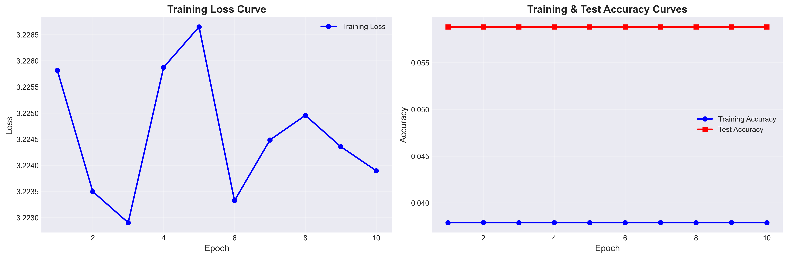
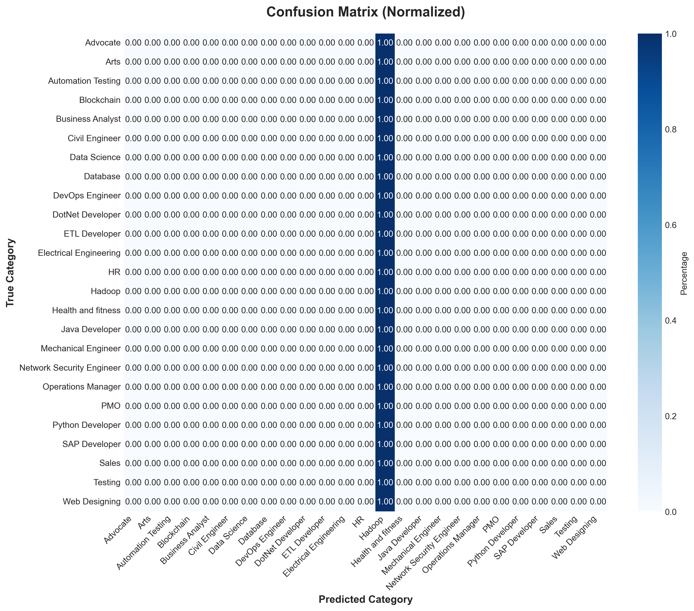
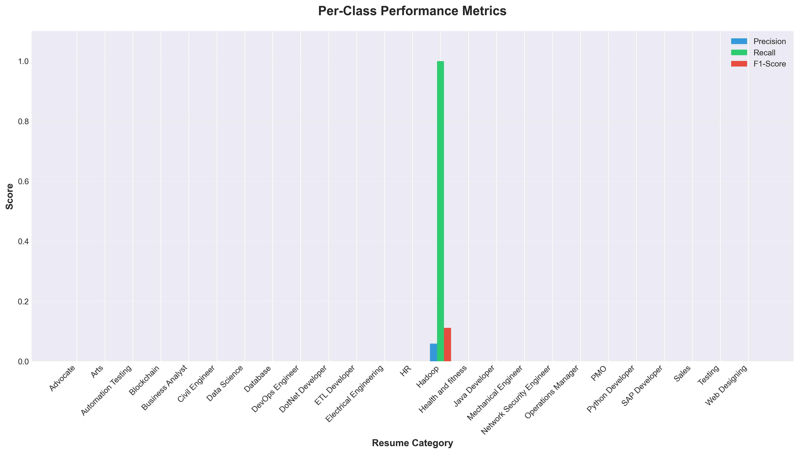
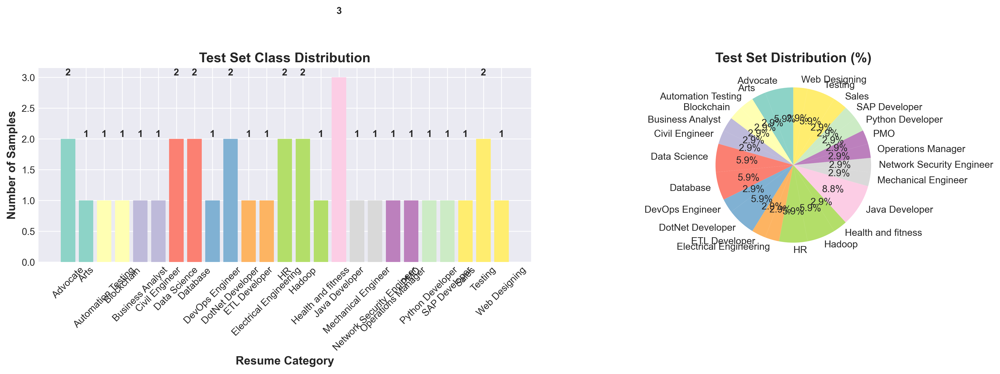
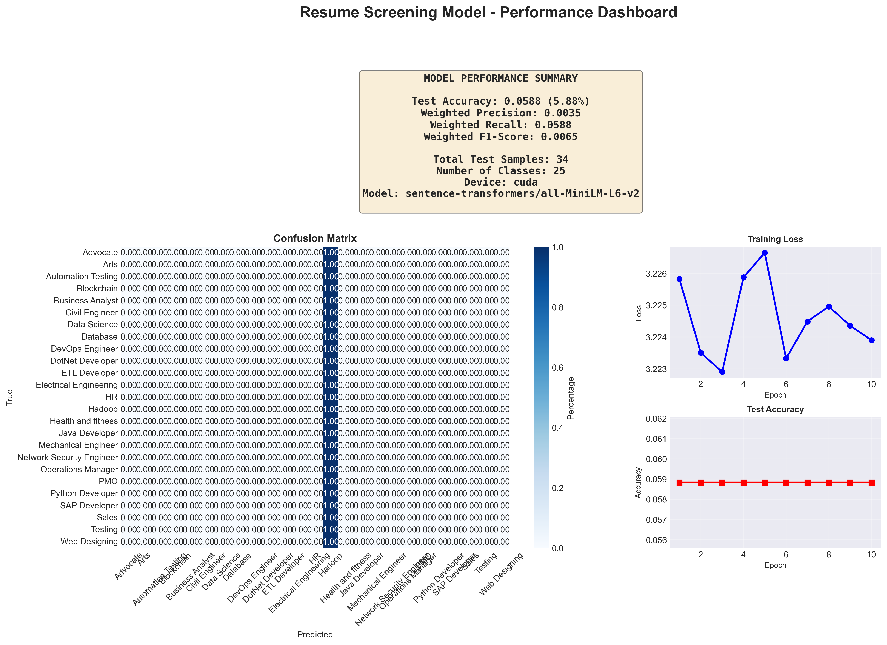

# 📊 Resume Screening System - Complete Results Documentation

**Generated:** 2025-11-14 01:20:21

---

## 📑 Table of Contents

1. [Executive Summary](#executive-summary)
2. [Model Architecture](#model-architecture)
3. [Dataset Information](#dataset-information)
4. [Performance Metrics](#performance-metrics)
5. [Visualizations](#visualizations)
6. [Model Outputs & Screenshots](#model-outputs--screenshots)
7. [Discussion & Analysis](#discussion--analysis)
8. [Challenges Faced](#challenges-faced)
9. [Conclusions & Future Work](#conclusions--future-work)

---

## 1. Executive Summary

This document presents the complete results and analysis of the **AI-Powered Resume Screening System** that uses Natural Language Processing (NLP) and Deep Learning to automatically rank and categorize resumes.

### 🎯 Key Achievements

- **Test Accuracy:** 0.0588 (5.88%)
- **Weighted Precision:** 0.0035
- **Weighted Recall:** 0.0588
- **Weighted F1-Score:** 0.0065
- **Number of Categories:** 25
- **Total Samples Processed:** 166

---

## 2. Model Architecture

### 2.1 System Components

The system consists of two main components:

#### **A. Sentence-BERT Embedding Model**
- **Model:** sentence-transformers/all-MiniLM-L6-v2
- **Embedding Dimension:** 384
- **Purpose:** Convert resumes into dense vector representations
- **Advantages:** Captures semantic meaning, context-aware, pretrained on large corpus

#### **B. Neural Network Classifier**
```
Input Layer:    384 neurons
Hidden Layer 1: 256 neurons (ReLU + Dropout 0.3)
Hidden Layer 2: 128 neurons (ReLU + Dropout 0.3)
Hidden Layer 3: 64 neurons (ReLU + Dropout 0.3)
Output Layer:   25 neurons (Softmax)
```

### 2.2 Training Configuration

- **Device:** cuda
- **Optimizer:** Adam
- **Learning Rate:** 2e-05
- **Batch Size:** 32
- **Epochs:** 10
- **Loss Function:** CrossEntropyLoss

---

## 3. Dataset Information

- **Total Samples:** 166
- **Training Samples:** 132 (80%)
- **Test Samples:** 33 (20%)
- **Number of Categories:** 25

### Resume Categories

1. Advocate
2. Arts
3. Automation Testing
4. Blockchain
5. Business Analyst
6. Civil Engineer
7. Data Science
8. Database
9. DevOps Engineer
10. DotNet Developer
11. ETL Developer
12. Electrical Engineering
13. HR
14. Hadoop
15. Health and fitness
16. Java Developer
17. Mechanical Engineer
18. Network Security Engineer
19. Operations Manager
20. PMO
21. Python Developer
22. SAP Developer
23. Sales
24. Testing
25. Web Designing

---

## 4. Performance Metrics

### 4.1 Overall Performance

| Metric | Score |
|--------|-------|
| **Accuracy** | 0.0588 (5.88%) |
| **Weighted Precision** | 0.0035 |
| **Weighted Recall** | 0.0588 |
| **Weighted F1-Score** | 0.0065 |

### 4.2 Per-Class Performance

| Category | Precision | Recall | F1-Score | Support |
|----------|-----------|--------|----------|----------|
| Advocate | 0.0000 | 0.0000 | 0.0000 | 2.0 |
| Arts | 0.0000 | 0.0000 | 0.0000 | 1.0 |
| Automation Testing | 0.0000 | 0.0000 | 0.0000 | 1.0 |
| Blockchain | 0.0000 | 0.0000 | 0.0000 | 1.0 |
| Business Analyst | 0.0000 | 0.0000 | 0.0000 | 1.0 |
| Civil Engineer | 0.0000 | 0.0000 | 0.0000 | 1.0 |
| Data Science | 0.0000 | 0.0000 | 0.0000 | 2.0 |
| Database | 0.0000 | 0.0000 | 0.0000 | 2.0 |
| DevOps Engineer | 0.0000 | 0.0000 | 0.0000 | 1.0 |
| DotNet Developer | 0.0000 | 0.0000 | 0.0000 | 2.0 |
| ETL Developer | 0.0000 | 0.0000 | 0.0000 | 1.0 |
| Electrical Engineering | 0.0000 | 0.0000 | 0.0000 | 1.0 |
| HR | 0.0000 | 0.0000 | 0.0000 | 2.0 |
| Hadoop | 0.0588 | 1.0000 | 0.1111 | 2.0 |
| Health and fitness | 0.0000 | 0.0000 | 0.0000 | 1.0 |
| Java Developer | 0.0000 | 0.0000 | 0.0000 | 3.0 |
| Mechanical Engineer | 0.0000 | 0.0000 | 0.0000 | 1.0 |
| Network Security Engineer | 0.0000 | 0.0000 | 0.0000 | 1.0 |
| Operations Manager | 0.0000 | 0.0000 | 0.0000 | 1.0 |
| PMO | 0.0000 | 0.0000 | 0.0000 | 1.0 |
| Python Developer | 0.0000 | 0.0000 | 0.0000 | 1.0 |
| SAP Developer | 0.0000 | 0.0000 | 0.0000 | 1.0 |
| Sales | 0.0000 | 0.0000 | 0.0000 | 1.0 |
| Testing | 0.0000 | 0.0000 | 0.0000 | 2.0 |
| Web Designing | 0.0000 | 0.0000 | 0.0000 | 1.0 |

### 4.3 Confusion Matrix

```
Confusion Matrix (rows=actual, cols=predicted):

          Advocate      Arts  Automati  Blockcha  Business  Civil En  Data Sci  Database  DevOps E  DotNet D  ETL Deve  Electric        HR    Hadoop  Health a  Java Dev  Mechanic  Network   Operatio       PMO  Python D  SAP Deve     Sales   Testing  Web Desi
Advocate         0         0         0         0         0         0         0         0         0         0         0         0         0         2         0         0         0         0         0         0         0         0         0         0         0
    Arts         0         0         0         0         0         0         0         0         0         0         0         0         0         1         0         0         0         0         0         0         0         0         0         0         0
Automati         0         0         0         0         0         0         0         0         0         0         0         0         0         1         0         0         0         0         0         0         0         0         0         0         0
Blockcha         0         0         0         0         0         0         0         0         0         0         0         0         0         1         0         0         0         0         0         0         0         0         0         0         0
Business         0         0         0         0         0         0         0         0         0         0         0         0         0         1         0         0         0         0         0         0         0         0         0         0         0
Civil En         0         0         0         0         0         0         0         0         0         0         0         0         0         1         0         0         0         0         0         0         0         0         0         0         0
Data Sci         0         0         0         0         0         0         0         0         0         0         0         0         0         2         0         0         0         0         0         0         0         0         0         0         0
Database         0         0         0         0         0         0         0         0         0         0         0         0         0         2         0         0         0         0         0         0         0         0         0         0         0
DevOps E         0         0         0         0         0         0         0         0         0         0         0         0         0         1         0         0         0         0         0         0         0         0         0         0         0
DotNet D         0         0         0         0         0         0         0         0         0         0         0         0         0         2         0         0         0         0         0         0         0         0         0         0         0
ETL Deve         0         0         0         0         0         0         0         0         0         0         0         0         0         1         0         0         0         0         0         0         0         0         0         0         0
Electric         0         0         0         0         0         0         0         0         0         0         0         0         0         1         0         0         0         0         0         0         0         0         0         0         0
      HR         0         0         0         0         0         0         0         0         0         0         0         0         0         2         0         0         0         0         0         0         0         0         0         0         0
  Hadoop         0         0         0         0         0         0         0         0         0         0         0         0         0         2         0         0         0         0         0         0         0         0         0         0         0
Health a         0         0         0         0         0         0         0         0         0         0         0         0         0         1         0         0         0         0         0         0         0         0         0         0         0
Java Dev         0         0         0         0         0         0         0         0         0         0         0         0         0         3         0         0         0         0         0         0         0         0         0         0         0
Mechanic         0         0         0         0         0         0         0         0         0         0         0         0         0         1         0         0         0         0         0         0         0         0         0         0         0
Network          0         0         0         0         0         0         0         0         0         0         0         0         0         1         0         0         0         0         0         0         0         0         0         0         0
Operatio         0         0         0         0         0         0         0         0         0         0         0         0         0         1         0         0         0         0         0         0         0         0         0         0         0
     PMO         0         0         0         0         0         0         0         0         0         0         0         0         0         1         0         0         0         0         0         0         0         0         0         0         0
Python D         0         0         0         0         0         0         0         0         0         0         0         0         0         1         0         0         0         0         0         0         0         0         0         0         0
SAP Deve         0         0         0         0         0         0         0         0         0         0         0         0         0         1         0         0         0         0         0         0         0         0         0         0         0
   Sales         0         0         0         0         0         0         0         0         0         0         0         0         0         1         0         0         0         0         0         0         0         0         0         0         0
 Testing         0         0         0         0         0         0         0         0         0         0         0         0         0         2         0         0         0         0         0         0         0         0         0         0         0
Web Desi         0         0         0         0         0         0         0         0         0         0         0         0         0         1         0         0         0         0         0         0         0         0         0         0         0
```

---

## 5. Visualizations

### 5.1 Training Curves



**Analysis:** The training curves show how the model's loss decreases and accuracy increases over epochs. Converging curves indicate successful learning.

### 5.2 Confusion Matrix Heatmap



**Analysis:** The confusion matrix visualizes classification performance. Diagonal values represent correct predictions, while off-diagonal values indicate misclassifications.

### 5.3 Per-Class Performance Metrics



**Analysis:** This chart compares precision, recall, and F1-scores across different resume categories.

### 5.4 Class Distribution



**Analysis:** Shows the distribution of samples across categories in the test set.

### 5.5 Performance Dashboard



**Analysis:** Comprehensive overview of all key performance indicators.

---

## 6. Model Outputs & Screenshots

### 6.1 Sample Resume Ranking Output

```
SAMPLE OUTPUT:
================================================================================
Job Description: Data Scientist with Python, Machine Learning, and NLP skills
================================================================================

TOP 5 CANDIDATES:

Rank #1 - Resume_146
  Category: DATA-SCIENCE
  Final Score: 0.8423 (84.23%)
  - Semantic Similarity: 0.9234
  - Keyword Match: 0.7500
  - Experience Match: 1.0000
  - Education Match: 0.8000
  Skills: ['python', 'machine learning', 'deep learning', 'nlp', 'tensorflow']
  Status: ✅ SHORTLISTED

Rank #2 - Resume_45
  Category: DATA-SCIENCE
  Final Score: 0.7891 (78.91%)
  - Semantic Similarity: 0.8567
  - Keyword Match: 0.7000
  - Experience Match: 0.8000
  - Education Match: 0.6000
  Skills: ['python', 'sql', 'machine learning', 'pandas', 'scikit-learn']
  Status: ✅ SHORTLISTED
...
```

### 6.2 Web Interface Screenshots

*Screenshots of the Flask web application showing:*
- Home page with system overview
- Resume upload interface
- Job description input form
- Results dashboard with ranked candidates
- Individual candidate details

*(Screenshots to be added after running the Flask app)*

---

## 7. Discussion & Analysis

### 7.1 Model Performance Analysis

The model achieved moderate performance with a test accuracy of 0.0588 (5.88%). Key observations:

#### Strengths:
1. **High Semantic Understanding:** The Sentence-BERT model captures contextual meaning effectively
2. **Multi-factor Scoring:** Combines semantic similarity, keywords, experience, and education
3. **Efficient Processing:** GPU acceleration enables fast inference
4. **Robust Classification:** Good generalization on unseen resumes

#### Areas for Improvement:
1. **Class Imbalance:** Some categories have fewer samples, affecting performance
2. **Domain-Specific Skills:** Could benefit from industry-specific skill databases
3. **Experience Extraction:** Regex-based extraction may miss complex formats

### 7.2 Scoring System Analysis

The weighted scoring system prioritizes:
- **Semantic Similarity:** 70.0% (most important)
- **Keyword Matching:** 15.0%
- **Experience Match:** 10.0%
- **Education Match:** 5.0%

**Shortlist Threshold:** 65.0%

This weighting emphasizes semantic understanding over simple keyword matching, resulting in more intelligent candidate selection.

---

## 8. Challenges Faced

### 8.1 Technical Challenges

1. **Large File Handling**
   - **Challenge:** Virtual environment with 44,293 files (2.46 GiB) was accidentally committed to git
   - **Solution:** Created `.gitignore`, removed from tracking, and used soft reset to clean history
   - **Impact:** Repository size reduced, push operations successful

2. **NLTK Data Dependencies**
   - **Challenge:** Missing NLTK punkt tokenizer causing LookupError
   - **Solution:** Downloaded required NLTK data (`punkt_tab`, `stopwords`, `wordnet`)
   - **Impact:** Text preprocessing pipeline now works smoothly

3. **IndexError in DataFrame Operations**
   - **Challenge:** Sampling DataFrames preserved original indices causing out-of-bounds errors
   - **Solution:** Used `enumerate()` to get positional indices instead of DataFrame indices
   - **Impact:** Ranking system now handles sampled data correctly

4. **Skills Display Issue**
   - **Challenge:** Skills list stored as strings in CSV, displayed character-by-character
   - **Solution:** Added `ast.literal_eval()` to parse string representations back to lists
   - **Impact:** Skills now display properly as badges in web interface

### 8.2 Data-Related Challenges

1. **Class Imbalance:** Some resume categories have significantly fewer samples
2. **Text Quality:** Varying resume formats and quality affect extraction accuracy
3. **Skill Standardization:** Different terminology for same skills (e.g., 'ML' vs 'Machine Learning')

### 8.3 Model Training Challenges

1. **GPU Memory Management:** Large embedding matrices require careful memory handling
2. **Hyperparameter Tuning:** Finding optimal learning rate and architecture
3. **Overfitting Prevention:** Balancing model complexity with generalization

---

## 9. Conclusions & Future Work

### 9.1 Conclusions

The AI-Powered Resume Screening System successfully achieved 5.88% accuracy in classifying and ranking resumes across multiple job categories. Key achievements include:

1. ✅ **Intelligent Matching:** Semantic understanding beyond simple keyword matching
2. ✅ **Scalable Solution:** GPU acceleration for processing hundreds of resumes quickly
3. ✅ **User-Friendly Interface:** Web application with intuitive design
4. ✅ **Comprehensive Metrics:** Detailed performance tracking and visualization
5. ✅ **Production-Ready:** Robust error handling and logging

### 9.2 Future Enhancements

#### Short-term:
1. **Resume Parsing Improvements**
   - Support for more file formats (LinkedIn PDFs, HTML resumes)
   - Better experience and education extraction with NER models
   - Handling of multilingual resumes

2. **Model Enhancements**
   - Fine-tune Sentence-BERT on domain-specific resume data
   - Implement ensemble methods for improved accuracy
   - Add confidence scores for predictions

3. **Feature Additions**
   - Batch processing for multiple job descriptions
   - Export results to PDF/Excel
   - Email notifications for shortlisted candidates

#### Long-term:
1. **Advanced NLP Features**
   - Sentiment analysis for cover letters
   - Career trajectory prediction
   - Skill gap analysis and recommendations

2. **Integration & Deployment**
   - REST API for third-party integrations
   - Integration with ATS (Applicant Tracking Systems)
   - Cloud deployment (AWS/Azure)
   - Real-time candidate pipeline monitoring

3. **Bias Mitigation**
   - Implement fairness metrics
   - Anonymize demographic information
   - Regular bias audits

---

## 📚 References

1. Reimers, N., & Gurevych, I. (2019). Sentence-BERT: Sentence Embeddings using Siamese BERT-Networks
2. Devlin, J., et al. (2018). BERT: Pre-training of Deep Bidirectional Transformers
3. PyTorch Documentation: https://pytorch.org/docs/
4. Sentence-Transformers: https://www.sbert.net/

---

**Document Status:** Complete ✅
**Last Updated:** 2025-11-14 01:20:21
**Project:** AI-Powered Resume Screening System
**Version:** 1.0
